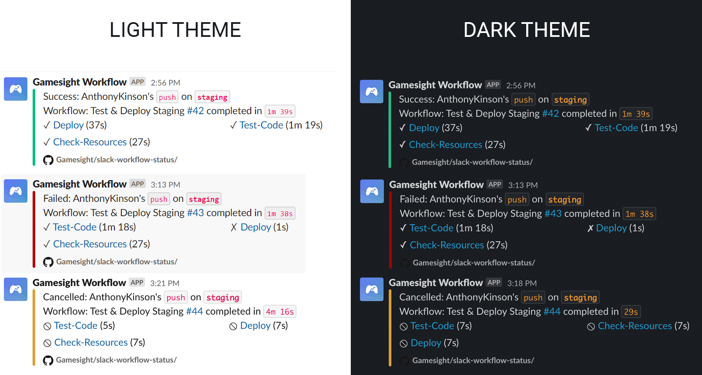
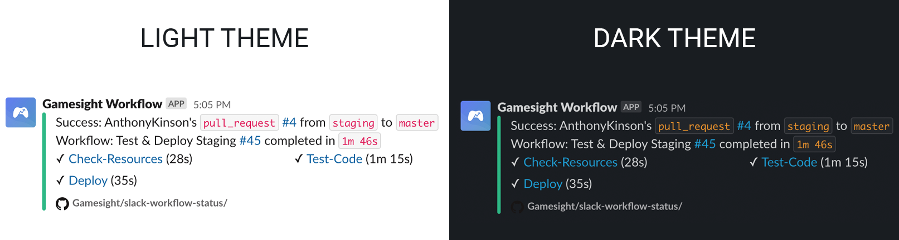

# Slack Workflow Status
This action will post workflow status notifications into your Slack channel. The notification includes the name of the Actor, Event, Branch, Workflow Name, Status and Run Durations. This action can optionally include the status and duration of individual jobs in a workflow to quickly help you identify where failures and slowdowns occur.



## Action Inputs

| Name                       | Required | Description |
|----------------------------| -------- | ----------- |
| **slack_webhook_url**      | _required_ | Create a Slack Webhook URL using the [Incoming Webhooks App](https://slack.com/apps/A0F7XDUAZ-incoming-webhooks?next_id=0). It is recommended that you create a new secret on your repo `SLACK_WEBHOOK_URL` for holding this value, and passing it to the action with `${{secrets.SLACK_WEBHOOK_URL}}`.
| **repo_token**             | _required_ | A token is automatically available in your workflow secrets var. `${{secrets.GITHUB_TOKEN}}`. You can optionally send an alternative self-generated token.
| **include_jobs**           | _optional_ | When set to `true`, include individual job status and durations in the slack notification. When `false` only the event status and workflow status lines are included. When set to `on-failure` — individual job status is reported only if workflow failed. Default is `true`.
| **display_only_failed**    | _optional_ | When set to `true`, only failed jobs will be shown in case of failure. Default is `false`.
| **include_commit_message** | _optional_ | When set to `true`, include the workflow head commit message title in the slack notification. Default is `false`.
| **channel**                | _optional_ | Accepts a Slack channel name where you would like the notifications to appear. Overrides the default channel created with your webhook.
| **name**                   | _optional_ | Allows you to provide a name for the slack bot user posting the notifications. Overrides the default name created with your webhook.
| **icon_emoji**             | _optional_ | Allows you to provide an emoji as the slack bot user image when posting notifications. Overrides the default image created with your webhook. _[Emoji Code Cheat Sheet](https://www.webfx.com/tools/emoji-cheat-sheet/)_
| **icon_url**               | _optional_ | Allows you to provide a URL for an image to use as the slack bot user image when posting notifications. Overrides the default image created with your webhook.


## Usage
To use this action properly, you should create a new `job` at the end of your workflow that `needs` all other jobs in the workflow. This ensures that this action is only run once all jobs in your workflow are complete.

This action requires `read` permission of `actions` scope. You should assign a job level `actions` permission if workflow level `actions` permission is set `none`.

```yaml
name: World Greeter
on:
  push:
    branches: [ master, staging ]
jobs:
  job-1:
    runs-on: ubuntu-latest
    steps:
      - name: Say Hello
        run: echo "Hello"
  job-2:
    runs-on: ubuntu-latest
    steps:
      - name: Say World
        run: echo "World"
  slack-workflow-status:
    if: always()
    name: Post Workflow Status To Slack
    needs:
      - job-1
      - job-2
    runs-on: ubuntu-latest
    # actions.read permission is required.
    permissions:
      actions: 'read'
    steps:
      - name: Slack Workflow Notification
        uses: Gamesight/slack-workflow-status@master
        with:
          # Required Input
          repo_token: ${{secrets.GITHUB_TOKEN}}
          slack_webhook_url: ${{secrets.SLACK_WEBHOOK_URL}}
          # Optional Input
          channel: '#anthony-test-channel'
          name: 'Anthony Workflow Bot'
          icon_emoji: ':poop:'
          icon_url: 'https://avatars0.githubusercontent.com/u/1701160?s=96&v=4'
```

This action can also be used for Pull Request workflows and will include pull request information in the notification.




_developed and maintained by: [gamesight.io](https://gamesight.io)_
