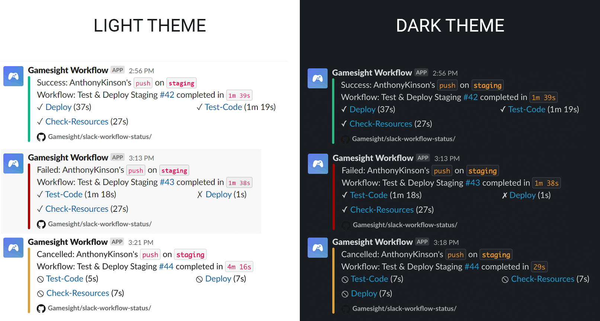
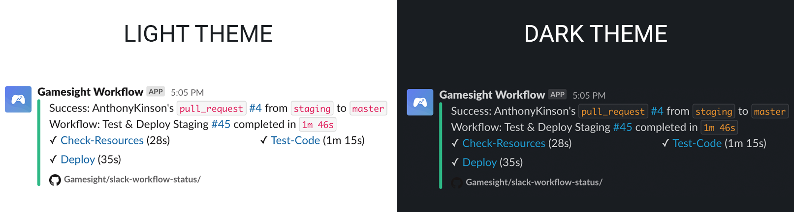

# Slack Workflow Status

[](https://github.com/Gamesight/slack-workflow-status/actions/workflows/ci.yml)

This action will post workflow status notifications into your Slack channel. The notification includes the name of the Actor, Event, Branch, Workflow Name, Status and Run Durations. This action can optionally include the status and duration of individual jobs in a workflow to quickly help you identify where failures and slowdowns occur.



## Action Inputs

| Name                       | Required | Description |
|----------------------------| -------- | ----------- |
| **slack_webhook_url**      | _one of_ | Slack Incoming Webhook URL. Provide either this or `slack_bot_token` (not both). Recommended via `${{secrets.SLACK_WEBHOOK_URL}}`. Create one with the [Incoming Webhooks App](https://slack.com/apps/A0F7XDUAZ-incoming-webhooks?next_id=0).
| **slack_bot_token**        | _one of_ | Slack Bot User OAuth Token (`xoxb-…`) — posts via the Slack Web API instead of an Incoming Webhook. Useful when your workspace has webhooks disabled, or to post to multiple channels and DMs from a single secret. The Slack app needs `chat:write` (and `chat:write.public` to post in channels the bot isn't a member of). When this input is set, **`channel` is required**. Falls back to the `SLACK_BOT_TOKEN` env var when the input is empty.
| **repo_token**             | _required_ | A token is automatically available in your workflow secrets var. `${{secrets.GITHUB_TOKEN}}`. You can optionally send an alternative self-generated token.
| **include_jobs**           | _optional_ | When set to `true`, include individual job status and durations in the slack notification. When `false` only the event status and workflow status lines are included. When set to `on-failure` — individual job status is reported only if workflow failed. Default is `true`.
| **hide_job_statuses**      | _optional_ | Comma-separated list of [job conclusions](https://docs.github.com/en/rest/checks/runs?apiVersion=2022-11-28#about-the-conclusion-of-a-check-run) to hide from the rendered job list — e.g. `skipped` to hide noisy matrix-skip entries while keeping successes and failures visible. The overall workflow color/text always reflects the real result. Default is empty (show every completed job).
| **extra_text**             | _optional_ | Free-form text appended to the notification body. Useful for adding a deploy URL, ticket link, channel mention, or any other context that should travel with the message. Default is empty.
| **jobs_to_fetch**           | _optional_ | Sets the number of jobs to fetch (for workflows with big number of jobs). Default is 30.
| **include_commit_message** | _optional_ | When set to `true`, include the workflow head commit message title in the slack notification. Default is `false`.
| **channel**                | _optional / required with bot token_ | Where to post the notification. With `slack_webhook_url`, overrides the default channel attached to the webhook (workspace permitting). With `slack_bot_token`, this is **required** and accepts a channel name (`#release`), channel ID (`C0123…`), or user ID (`U0123…`) for DMs.
| **name**                   | _optional_ | Allows you to provide a name for the slack bot user posting the notifications. Overrides the default name created with your webhook.
| **icon_emoji**             | _optional_ | Allows you to provide an emoji as the slack bot user image when posting notifications. Overrides the default image created with your webhook. _[Emoji Code Cheat Sheet](https://www.webfx.com/tools/emoji-cheat-sheet/)_
| **icon_url**               | _optional_ | Allows you to provide a URL for an image to use as the slack bot user image when posting notifications. Overrides the default image created with your webhook.
| **workflow_run**           | _optional_ | Set to `"true"` when this action runs in a workflow triggered by the `workflow_run` event. The notification will then describe the upstream workflow that fired the event rather than this notifier workflow itself. Default is `"false"`.


## Usage
To use this action properly, you should create a new `job` at the end of your workflow that `needs` all other jobs in the workflow. This ensures that this action is only run once all jobs in your workflow are complete.

This action requires `read` permission of `actions` scope. You should assign a job level `actions` permission if workflow level `actions` permission is set `none`.

```yaml
name: World Greeter
on:
  push:
    branches: [ master, staging ]
jobs:
  job-1:
    runs-on: ubuntu-latest
    steps:
      - name: Say Hello
        run: echo "Hello"
  job-2:
    runs-on: ubuntu-latest
    steps:
      - name: Say World
        run: echo "World"
  slack-workflow-status:
    if: always()
    name: Post Workflow Status To Slack
    needs:
      - job-1
      - job-2
    runs-on: ubuntu-latest
    # actions.read permission is required.
    permissions:
      actions: 'read'
    steps:
      - name: Slack Workflow Notification
        uses: Gamesight/slack-workflow-status@master
        with:
          # Required Input
          repo_token: ${{secrets.GITHUB_TOKEN}}
          slack_webhook_url: ${{secrets.SLACK_WEBHOOK_URL}}
          # Optional Input
          channel: '#anthony-test-channel'
          name: 'Anthony Workflow Bot'
          icon_emoji: ':poop:'
          icon_url: 'https://avatars0.githubusercontent.com/u/1701160?s=96&v=4'
```

This action can also be used for Pull Request workflows and will include pull request information in the notification.



### Posting with a Slack Bot Token

If your workspace has Incoming Webhooks disabled, or you want a single
credential that can post to many channels (and DMs), use a Bot User OAuth
Token (`xoxb-…`) instead. The bot must have the `chat:write` scope (plus
`chat:write.public` if you want to post in channels it hasn't been
invited to).

```yaml
- name: Slack Workflow Notification
  uses: Gamesight/slack-workflow-status@master
  with:
    repo_token: ${{secrets.GITHUB_TOKEN}}
    slack_bot_token: ${{secrets.SLACK_BOT_TOKEN}}
    channel: '#release-notifications'   # required when using a bot token
    # channel: 'U01ABCDEF'              # or DM a specific user by ID
    name: 'Workflow Bot'
    icon_emoji: ':rocket:'
```

Provide **either** `slack_webhook_url` **or** `slack_bot_token` — setting
both is rejected.

## Troubleshooting

### `Resource not accessible by integration`

This error means the token passed via `repo_token` lacks the permissions
needed to read the workflow run and its jobs (issue #45). The action calls
`actions.getWorkflowRun` and `actions.listJobsForWorkflowRun`, both of which
require the `actions: read` permission on the token.

If the workflow declares a top-level `permissions:` block, that block
overrides the default `GITHUB_TOKEN` permissions for every job — including
this one. You must explicitly grant `actions: read` either at the workflow
level or on the notifier job:

```yaml
jobs:
  slack-workflow-status:
    permissions:
      actions: read     # required: read this run's jobs
      contents: read    # required when using `workflow_run`: read the upstream run
    # ...
```

When using the `workflow_run` input, the notifier workflow runs in a
separate context from the workflow it reports on. The `GITHUB_TOKEN` for `workflow_run`-triggered runs is
issued against the *base* repository, so PRs from forks will work, but the
token still needs `actions: read` and `contents: read` on the base repo.

### Bot token errors

When using `slack_bot_token`, errors from Slack are surfaced via
`core.setFailed`. The most common ones:

- **`not_in_channel`** — invite the bot to the channel, or grant the
  `chat:write.public` scope so it can post without being a member.
- **`channel_not_found`** — for private channels, pass the channel ID
  (`C0123…`) instead of the name. For DMs, pass the user ID (`U0123…`).
- **`invalid_auth`** / **`token_revoked`** — the token has been rotated
  or doesn't belong to this workspace; re-issue from the Slack app's
  *OAuth & Permissions* page.
- **`missing_scope`** — add `chat:write` (and optionally
  `chat:write.public` / `chat:write.customize` for `username` and
  `icon_*` overrides) and reinstall the app.

### Notification fires before all jobs finish

Make sure the notifier job uses both `if: always()` and `needs:` listing
every job you want it to wait on. Without `needs:` the notifier may run
in parallel with your other jobs and report incomplete results.

_developed and maintained by: [gamesight.io](https://gamesight.io)_
